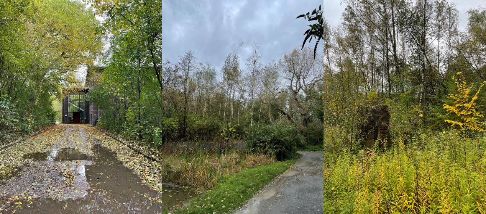

***

> Der Industriewald Rheinelbe – Herzstück und Original des Projektes Industriewald 

Der Industriewald Rheinelbe wird als Herzstück des Projektes Industriewald beschrieben. Gelegen ist der Wald zwischen Gelsenkirchen, Bochum und Essen auf der Fläche einer ehemaligen Zeche. In der unmittelbaren Umgebung des Waldes befindet sich dichte Bebauung und die verschiedensten sozialen Schichten sind in den angrenzenden Gebieten vertreten. Auf dem 36,5 Hektar großen Areal lässt sich die Geschichte des Gebiets noch immer ablesen. Es ist geprägt von zwei Halden und den Überresten der industriellen Vornutzung. Besitzer des Geländes sind das Land NRW (Wald und Holz NRW) und der Regionalverband Ruhr. Dort ist die Forststation von Wald und Holz NRW mit ihren Mitarbeitern angesiedelt. Neben seinem ökologischen Nutzen, dient der Wald in erster Linie als Naturerfahrungsraum und „Lehrwald“. Ausgehend von der Forststation werden dort Führungen veranstaltet. Zielgruppe sind vor allem die Kindergärten aus dem Umfeld, mit denen eine intensive Zusammenarbeit stattfindet. Durch die Einbeziehung und Ansprache von Bildungseinrichtungen für Kinder sollen auch deren Eltern erreicht werden. Auf diese Weise können mehrere Generationen erreicht werden. Grundsätzlich kann jedoch jeder eine Führung anfragen. Seit Projektbeginn wurden durch dieses Angebot mehr als 90 000 Menschen erreicht. Durch die gezielte Ansprache vor allem jüngerer Gruppen konnte ein gewisses integratives Potenzial des Naturerlebnisraums erreicht werden. Bei den Führungen werden Informationen über die Art der Bewirtschaftung und die Entwicklung eines Waldes sowie über mögliche Eingriffe in seine Entwicklung vermittelt. Darüber hinaus wird die biologische Vielfalt hervorgehoben, um die Multifunktionalität des Industriewaldes Rheinelbe zu verdeutlichen. Mit diesem Projekt und seiner Lage im Stadtgebiet des Ruhrgebiets wird auch versucht, eine ökologisch und sozial gerechte Verteilung von Grünflächen zu schaffen.

***Begehung des Geländes und persönliche Eindrücke***

Im Rahmen des Uni-Projektes wurde eine Begehung des Areals vorgenommen und persönliche Eindrücke gesammelt, wobei es nicht darum ging eine Vegetationsbestimmung vorzunehmen, sondern vielmehr Einsicht in das Projekt Industriewald zu sammeln. 

Bereits bei der Anfahrt wird deutlich, dass das Waldgebiet tatsächlich sehr urban gelegen ist. Auch die Erreichbarkeit mit öffentlichen Verkehrsmitteln ist kein Problem. Die nächstgelegene Bushaltestelle ist nur drei Gehminuten entfernt. Somit wird man im Wald regelrecht „ausgespuckt“. Mit einer Fläche von 36, 5 Hektar ist der Industriewald Rheinelbe der größte betreute Wald im Projekt. Der Überblick über das Gelände selber gestaltet sich allerdings unübersichtlich. Es gibt weder ein ausgeschildertes Wegenetz noch viele Informationen über das Projekt. Einige der Wege sind asphaltiert oder aus Kopfsteinpflaster, während andere eher Trampelpfaden gleichen. Beim Kennenlernen des Geländes hat man somit Schwierigkeiten, da man leicht an den umgebenen Gärten der Anwohner_innen strandet. 

Auf den ersten Blick erkennt man die ehemaligen Industrieanlagen, die immer wieder im Wald zu sehen sind. Manchmal springen sie einen förmlich an, während man an anderen Stellen eher zufällig mit den Augen über sie stolpert und überrascht ist. Hier ist das Erlebnis Industriewald wirklich sehr anschaulich umgesetzt. Die Halde unterstreicht zudem den kulturellen Hintergrund des Geländes. 

Der Wald selber zeichnet sich durch viele Birken aus, auch ist ein sehr dichtes Gestrüpp am Boden vorhanden. Ein Bestand an alten Bäumen wurde nicht gesehen, was aller Wahrscheinlichkeit daran liegt, dass sich der Industriewald noch in der Vorwaldphase befindet. Diese alleine kann mehrere Jahrzehnte an Entwicklung in Anspruch nehmen. Eine aktive Holzentnahme gibt es nicht, da überall umgeknickte Bäume und abgeknickte Äste sichtbar sind. Da eine natürliche Entwicklung der Wälder angestrebt wird, scheint das fehlende Eingreifen nur konsequent. Die in der Literatur immer wieder angesprochene Artenvielfalt auch im Tierreich wurde insofern erlebt, als das überall Vögel hör- und teilweise auch sichtbar waren. Andere Tierarten konnten nicht gesichtet werden, was keinesfalls heißt, dass sie nicht ansässig sind. 

Aufgrund von verschiedenen Aspekten kann man den Industriewald Rheinelbe durchaus als attraktives Freizeitangebot ansehen. Beim ersten Kennenlernen ist das Wegenetz zwar unübersichtlich, aber dies wird sich beim mehrmaligen Besuchen legen. Mit seiner Größe und Nähe zu besiedelten Gebieten ist er bestens für längere Spaziergänge geeignet. Die Halde Rheinelbe, die im Rahmen des Besuchs nicht bestiegen wurde, bietet Ausblick. Außerdem sind auf dem Gelände fünf Skulpturen zu finden, welche unter dem Projekt Skulpturenwald geführt werden. Auch hierzu fehlt es leider an Informationen. 

Die vier Ziele, welche sich für das Projekt gesetzt wurden, können im Industriewald Rheinelbe umgesetzt werden. Auf dem Gelände ist ein vitaler und sich immer weiter entwickelnder Wald entstanden, welcher sowohl soziale als auch ökologische Funktionen für die Umgebung erfüllt. Bei geringer Pflege bekommt die Natur Zeit und Raum sich zu regenerieren, was interessant für die Besucher_innen ist. Insgesamt überrascht der Industriewald Rheinelbe mit einer reizvollen Mischung aus ungestörten Waldwegen, die einem ganz allein zu gehören scheinen, und einem urbanen Gesicht, wenn man sich plötzlich an Gartenzäunen gestrandet findet.

```{r, echo = F, warning = F, fig.cap = '*Links: Blick auf die Forststation. Sie ist Sitz der Verwaltung von Wald und Holz NRW und liegt im Mitten im Industriewald Rheinelbe.  Mitte: Direkt angrenzend an die Forststation ist eine kleine Wasserfläche. Hinter ihr sieht man einen kleinen Birkenbestand und alte Industrieinfrastruktur, die überwachsen wird.  Rechts: Ein typischer Anblick beim Gang durch den Industriewald. Quelle: Eigene Aufnahme*', fig.width = 4, out.width = "100%"}

```

***

**Literaturhinweise:**

GAUSMANN, P., WEISS, J., KEIL, P. u. G.H. LOOS (2007): Wildnis kehrt zurück in den Ballungsraum. Die neuen Wälder des Ruhrgebietes. In: Praxis der Naturwissenschaften - Biologie in der Schule 56 (2).

UN DEKADE BIOLOGISCHE VIELFALT (2021): Industriewald Rheinelbe – Wildnis- und Naturerfahrungsraum im Ruhrgebiet. Abrufbar unter: https://www.undekade-biologischevielfalt.de/projekte/aktuelle-projekte-beitraege/detail/projekt-details/show/Wettbewerb/3615/ (letzter Abruf: 04.11.2021) 

***
