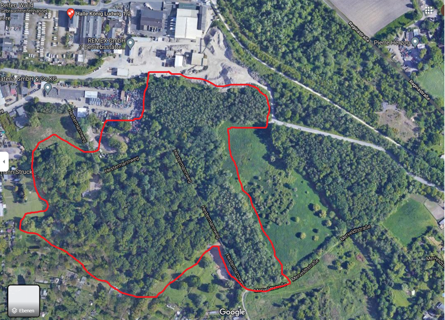
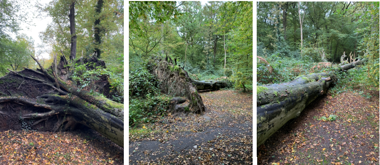
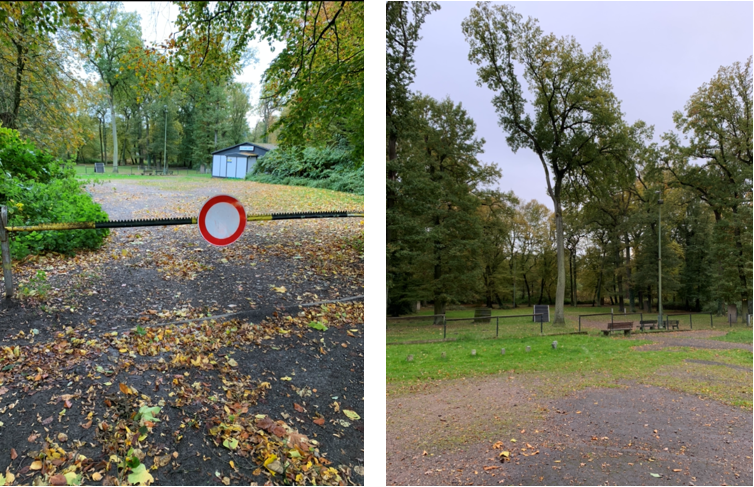

***

```{r, echo = F, warning = F, fig.cap = '*Quelle: Google Maps 2021*', fig.width = 4, out.width = "80%"}

```

> Der Industriewald “König Ludwig 1/2” in Recklinghausen hat eine Größe von 4,9 Hektar. Er befindet sich auf dem Gelände der ehemaligen Zeche König Ludwig, die bereits 1965 stillgelegt wurde. Es wurde im Rahmen dieses Projektes aus Zeitgründen keine Artbestimmung der Flora in den Industriewäldern gemacht, allerdings kann generell gesagt werden, dass es sich bei diesem Wald um einen Laubwald handelt. An vielen Stellen war der Boden zudem auch von Sträuchern bedeckt. 
     
     
```{r, echo = F, warning = F, fig.cap = '*Links: Laubbäume und Sträucher Rechts: Baumkronen (Quelle: Eigene Darstellung 2021)*', fig.width = 4, out.width = "80%"}
knitr::include_graphics('ludwig2.PNG')
``` 

Ein Merkmal der Industriewälder ist, dass kaum in die natürliche Entwicklung der Wälder eingegriffen wird. Zwar gibt es zwei Förster für das Projekt, diese sind jedoch für alle Industriewälder zuständig, die über das Ruhrgebiet verteilt liegen. Somit werden die Wälder im Großen und Ganzen sich selbst überlassen. Im Wald in König-Ludwig erkennt man diesen Umstand an mehreren Dingen. Zum Einen wurde bei der Besichtigung relativ häufig Schadholz auf dem Boden gesehen, also Bäume, die (vielleicht durch Sturmschäden, aus Altersschwäche oder durch Befall) umgefallen sind und nun auf dem Waldboden herumliegen. Darunter waren nicht nur kleines Gehölz und Geäst, sondern auch sehr dicke Stämme. Allerdings wurde aus der Besichtigung nicht ersichtlich, ob dies nur eine Momentaufnahme ist und das herumliegende Holz bzw Stämme möglicherweise bald „aufgeräumt“ werden, oder ob man dies grundsätzlich einfach sich selbst überlässt. Falls letzteres der Fall sein sollte, stellt sich die Frage, inwieweit eine solche Herangehensweise schädlich für den Wald sein könnte, da Schadholz anfällig dafür ist, von Borkenkäfern befallen zu werden, die sich dann von dort aus weiter ausbreiten und auch den restlichen Wald schädigen können.

```{r, echo = F, warning = F, , fig.width = 4, out.width = "100%"}

```

```{r, echo = F, warning = F, fig.cap = '*Herumliegende Baumstämme und Gehölz (Quelle: Eigene Darstellung 2021)*', fig.width = 4, out.width = "100%"}
knitr::include_graphics('ludwig4.PNG')
``` 


Das zweite Indiz für den geringen Eingriff durch den Menschen in die Entwicklung des Waldes ist die Wegeführung. Denn es gibt in dem Wald (bis auf den „Eingangsbereich“ des Waldes, der bis zu einer Schranke führt) keine normalen, breiten Wege, wie sie sonst in durch Menschen genutzten und unter förstlicher Aufsicht stehenden Wäldern üblich sind. Es gibt lediglich einige sehr schmale Trameplpfade, die sich eher an den Rändern des Waldes befinden, zudem gibt es im Zentrum des Waldes gar keine Wegeführung (sondern man kann überall langgehen), was dem Wald einen teilweise hallenartigen Charakter verleiht. 
 
```{r, echo = F, warning = F, fig.cap = '*Links: schmaler Trampelpfad Mitte & Rechts: Offener Wald ohne Wegeführung (Quelle: Eigene Darstellung 2021)*', fig.width = 4, out.width = "80%"}
knitr::include_graphics('ludwig6.PNG')
``` 

Es muss auch festgehalten werden, dass sich dieser Wald nicht wirklich für Freizeit- und Erholungsaktivitäten durch den Menschen eignet – auch wenn dies eines der Ziele des Projektes Industriewald Ruhrgebiet ist. Die fehlende Eignung liegt zum Einen daran, dass es keine guten Wege gibt, die zum Spazieren oder dergleichen genutzt werden könnten, zum Anderen aber auch an der zu geringen Größe des Waldes. Mit den knapp 5 Hektar ist der Wald zu klein, um wirklich attraktiv für eine größere Freizeitnutzung zu sein. Am Tag der Besichtigung (der jedoch durch schlechtes Wetter geprägt war) wurde nur eine einzige Person im Wald gesichtet, die mit ihrem Hund spazieren war. 
Hinsichtlich menschlicher Nutzung ist ansonsten noch erwähnenswert, dass sich relativ zu Beginn des Waldes (hinter der Schranke) ein Vereinsheim eines Hundesportvereins (DVG e.V.) mitsamt eines größeren, abgegrenzten Parks befindet. Hier war auch die Person mit ihrem Hund unterwegs. 


```{r, echo = F, warning = F, fig.cap = '*Links: Vereinsheim Hundesport Rechts: Dazugehöriger Park (Quelle: Eigene Darstellung 2021)*', fig.width = 4, out.width = "80%"}

``` 


Am östlichen Rand ist der Wald durch einen Zaun begrenzt. Allerdings ist der Zaun an einer Stelle, die zu einem offenen Feld und einer dahinterliegenden Straße führt (auf der sich auch der neue Radtrassenweg, der auf einer alten Bahntrasse der Zeche entstanden ist, befindet) kaputt, sodass man problemlos von dort aus in den Wald eintreten kann. Am westlichen und südlichen Rand schließen sich direkt Wohnbebauung sowie auch landwirtschaftlich genutzte Flächen an den Wald an. Nördlich grenzt ein Industriegebiet an den Wald. Hier befindet sich auch ein Parkplatz.


```{r, echo = F, warning = F, fig.cap = '*Links: Umzäunung Rechts: Kaputter Zaun mit offenem Feld und Straße dahinter (Quelle: Eigene Darstellung 2021)*', fig.width = 4, out.width = "80%"}
knitr::include_graphics('ludwig8.PNG')
``` 
       

```{r, echo = F, warning = F, fig.cap = '*Wohnbebauung angrenzend an den Wald (Quelle: Eigene Darstellung 2021)*', fig.width = 4, out.width = "80%"}
knitr::include_graphics('ludwig9.PNG')
``` 

Zusammenfassend lässt sich zu dem Industriewald König Ludwig 1/2 sagen, dass es sich hierbei um einen sehr kleinen Wald handelt, der auch verglichen mit den meisten der anderen Industriewälder eine sehr geringe Größe aufweist. Typisch für die Industriewälder ist auch hier, dass es kaum menschliche Eingriffe (etwa durch Förster) gibt, was sich besonders an der größeren Menge an herumliegendem Schadholz zeigt. Die Ziele, die sich das Projekt „Industriewald Ruhrgebiet“ gesetzt hat, sind in diesem Wald nur teilweise erreicht. So ist es zwar gelungen, dass die Natur sich auf dem Gelände der ehemaligen Zeche ihren Platz zurückerobert hat und somit aus ökologischer Sicht ein Nutzen für die Umwelt entstanden ist, in der auch bestimmte Fauna ihren Platz findet, allerdings ist das Ziel, einen „Rückzugs- und Erholungsort“ für die Menschen der Region zu schaffen, nur ansatzweise gelungen. Am ehesten wird der Wald durch den Menschen vermutlich noch in Folge des dort ansässigen Hundesportvereins genutzt. Ansonsten ist der Wald aber nach unseren Beobachtungen zu klein und hat keine ausreichende Wegeinfrastruktur, um für die Bevölkerung wirklich attraktiv zu sein in dem Sinne, zu Freizeitzwecken mal einen größeren „Ausflug“ dorthin zu machen. 

