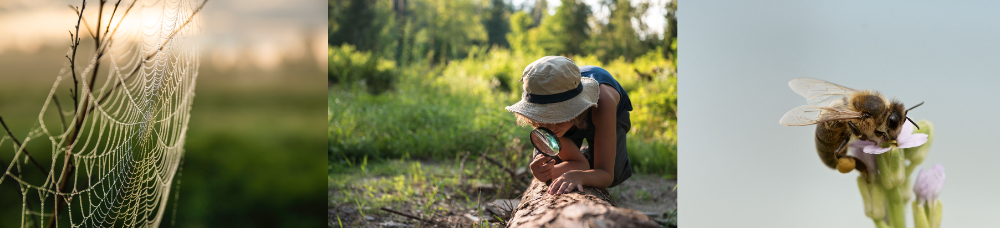

***
```{r, echo=FALSE, warning=FALSE}
library(knitr)
```


Den Industriewäldern im Ruhrgebiet werden im ökologischen Sinne einen hohen Nutzen zugesprochen, wodurch sie den Folgen des Klimawandels entgegengewirkt werden können. Insbesondere durch die Freiflächen, in dem sonst so dicht bebauten Ruhrgebiet, entstehen an dieser Stelle zahlreiche positive Auswirkungen: Bei Starkregenereignissen kann das Wasser in den Waldboden aufgenommen und gespeichert werden und entlastet somit das städtische Abwassersystem. Die Vegetation nimmt Wasser auf und sorgt durch die Verdunstung an warmen Sommermonaten für eine deutliche Absenkung der Lufttemperatur. Zudem heizt sich Waldfläche im Vergleich zu einer betonierten Straße wesentlich schwächer auf. Durch diese Temperaturunterschiede können sich abkühlende Frischluft-Winde bilden, die Hitzeinseln in den Städten auflösen. Je nach Größe und Lage der Freifläche, kann dieses Phänomen stark variieren.

> Der Mensch und die Umwelt profitieren gleichermaßen durch die neuerstandenen Grünflächen in Folge des Strukturwandels im Ruhrgebiet. 


Neben den ökologischen Folgen, stellen die neuerstandenen Wälder Erholungsgebiete mit einem hohen Freizeitfaktor für die Bevölkerung dar. Neben Tätigkeiten wie sportlichen Aktivitäten oder als Ort zum Verweilen und zum Begegnen, werden die Wälder zudem zu pädagogischen Zwecken genutzt: Der Wandel von einer montanindustriell-geprägten Fläche hin zu einem ökologisch – jungen – und einzigartigen Naturraum mit einer hohen Biodiversität, begeistern dabei Jung und Alt. So werden verschiedene waldpädagogische Aktivitäten auf den jeweiligen Internetplattformen der Industriewälder angeboten.

```{r, echo = F, warning = F, fig.cap = '*Quelle: Microsoft 2021*', fig.width = 4, out.width = "100%"}

```

***

**Literaturhinweise:**

BUNDESMINISTERIUM FÜR UMWELT, NATURSCHUTZ, BAU UND REAKTORSICHERHEIT (2015):  Grün in der Stadt - Für eine lebenswerte Zukunft. Abrufbar unter: https://www.bmi.bund.de/SharedDocs/downloads/DE/publikationen/themen/bauen/wohnen/gruenbuch-stadtgruen.pdf?__blob=publicationFile&v=3 (letzter Abruf: 04.11.2021)

STIFTUNG ZOLLVEREIN (2021): Natur auf Zollverein - Ein einzigartiger Lebensraum. Abrufbar unter: https://www.zollverein.de/app/uploads/2018/02/Natur-auf-Zollverein.pdf (letzter Abruf: 04.11.2021) 

***
